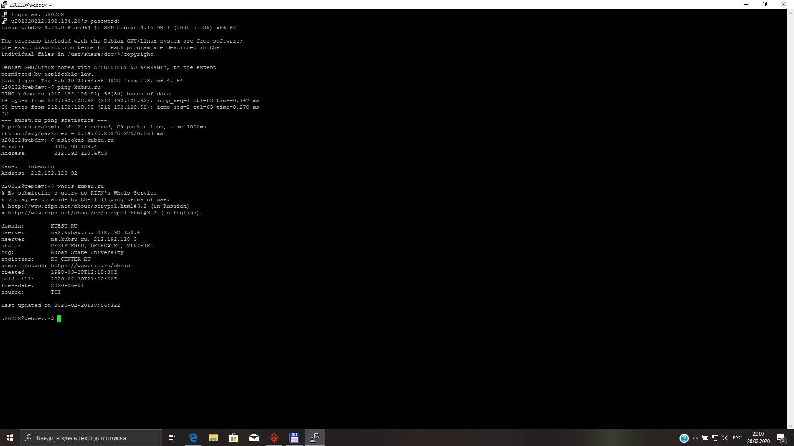
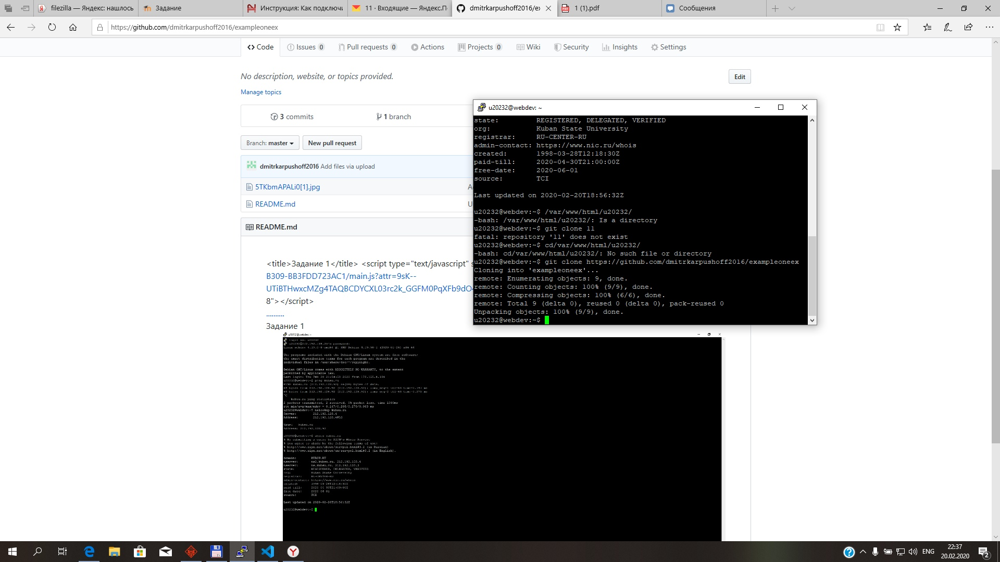
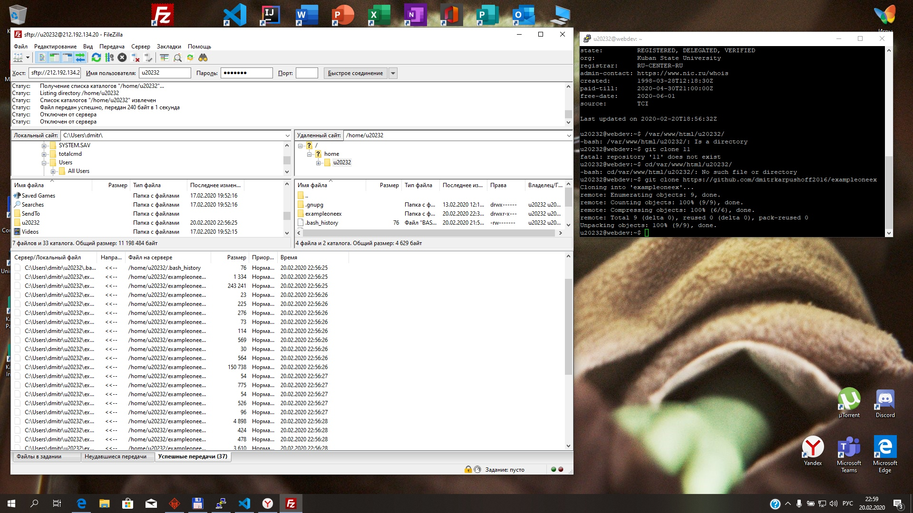

<!DOCTYPE html>
<html lang="ru">

  <head>
    <meta charset="UTF-8" />
    <link rel="stylesheet" href="style.css">
    <title>Задание 1</title>
  <link rel="stylesheet" crossorigin="anonymous" href="http://gc.kis.v2.scr.kaspersky-labs.com/E3E8934C-235A-4B0E-825A-35A08381A191/abn/main.css?attr=aHR0cDovL2suZG1pdHJ5MDAuZ2l0bGFiLmlvLzF3ZWIxLw"/></head>
  <body>
    

        <header>
          

            

        </header>
        <nav>
          

          <a class="text" href="#“Up”" title="Задание 1">..........</a>
        

        </nav>
        <main>
          

        
Задание 1

        <ol class="olol">
          <li>
          </a> 
          </li>
           <li>
          </a> 
          </li>
          <li>
          </a> 
          </li>
        </ol>
      

         

               Карпушов Дмитрий &copy; 2020
      

    

  </body>
</html>
